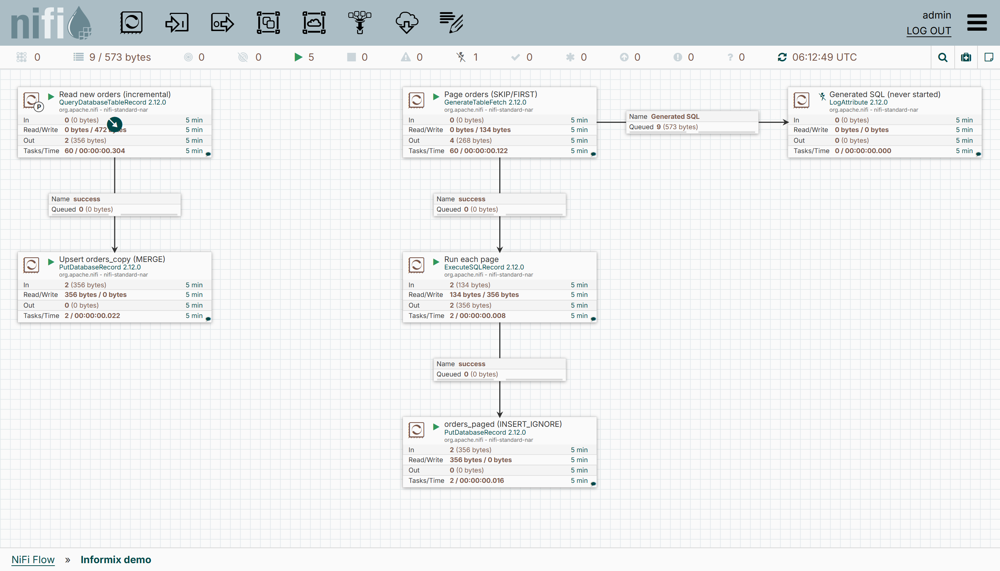

# Demo: NiFi 2.12.0 + Informix, end to end

One command starts an Informix developer edition, seeds a database, starts NiFi with the Informix
dialect NAR, imports a flow and shows rows being copied from one table into two others —
incrementally, with Informix-native SQL on both ends — together with the `SKIP`/`FIRST` statements
the dialect generated.



```
cd demo
./run.sh
```

Takes about two minutes on first run (Docker pulls `apache/nifi:2.12.0` and the Informix image,
roughly 2 GB together). Requirements: Docker with Compose v2, Maven, Java 21, `curl`. On Windows use
Git Bash.

## What it does

Two paths read the same source table, both through the Informix dialect:

```
                 ┌──▶  QueryDatabaseTableRecord  ──▶  PutDatabaseRecord (UPSERT)  ──▶  orders_copy
                 │      Maximum-value column: id        → MERGE INTO orders_copy ... WHEN MATCHED ... WHEN NOT MATCHED ...
Informix  orders ┤
                 │     GenerateTableFetch  ──▶  ExecuteSQLRecord  ──▶  PutDatabaseRecord (INSERT_IGNORE)  ──▶  orders_paged
                 └──▶   Partition Size: 2         runs each page        → MERGE INTO orders_paged ... WHEN NOT MATCHED THEN INSERT
                        → SELECT SKIP 2 FIRST 2 * FROM orders WHERE id <= 5 ORDER BY id
```

1. Builds the NAR if `nifi-informix-dialect-nar/target/` is empty.
2. Downloads the IBM Informix JDBC driver from Maven Central into `demo/drivers/` (git-ignored; the
   driver is IBM-licensed and never packaged with this project).
3. `docker compose up -d`: Informix initialises and runs [`informix/seed.sql`](informix/seed.sql)
   (database `demo`, tables `orders`, `orders_copy` and `orders_paged`, five rows in `orders`); NiFi
   starts with the NAR hot-loaded from `nar_extensions/` and the driver mounted at
   `/opt/nifi/nifi-current/drivers/`.
4. Imports [`nifi/informix-demo-flow.json`](nifi/informix-demo-flow.json) through the REST API, sets
   the database password on the connection pool (sensitive values are never part of a flow
   definition), enables the controller services and starts the process group.
5. Prints the SQL statements `GenerateTableFetch` produced, then `orders_copy` and `orders_paged`;
   inserts two more rows into `orders`, waits, and prints everything again. The first round shows
   three pages of two rows, the second round one more page for the new rows:
   ```
   SELECT FIRST 2 * FROM orders WHERE id <= 5 ORDER BY id
   SELECT SKIP 2 FIRST 2 * FROM orders WHERE id <= 5 ORDER BY id
   SELECT SKIP 4 FIRST 2 * FROM orders WHERE id <= 5 ORDER BY id
   SELECT FIRST 2 * FROM orders WHERE id > 5 AND id <= 7 ORDER BY id
   ```

Then open <https://localhost:8443/nifi> (`admin` / `adminadminadmin`, self-signed certificate) to
look at the flow, or connect any SQL client to
`jdbc:informix-sqli://localhost:9088/demo:INFORMIXSERVER=informix` (`informix` / `in4mix`) and
insert rows into `orders` yourself.

## What to look at

- Every database processor has *Database Type* `Database Dialect Service` and *Database Dialect
  Service* set to the `Informix Dialect` controller service.
- `Read new orders (incremental)` (`QueryDatabaseTableRecord`) generates
  `SELECT * FROM orders WHERE id > <last seen id>` — no paging, so plain SQL.
- `Page orders (SKIP/FIRST)` (`GenerateTableFetch`, *Partition Size* 2) generates one statement per
  page, and this is where the dialect shows: `SELECT SKIP 2 FIRST 2 * FROM orders WHERE id <= 5
  ORDER BY id` instead of `LIMIT 2 OFFSET 2`. The statements go to `Run each page`
  (`ExecuteSQLRecord`) and, as a copy, into the `Generated SQL` queue. That queue feeds
  `Generated SQL (never started)`, a disabled `LogAttribute`, so nothing ever drains it: right-click
  the queue → *List queue* → *View content* on any FlowFile to read the statement in the UI.
  `run.sh` prints the same statements through the REST API.
- `Upsert orders_copy (MERGE)` has *Statement Type* `UPSERT`, `orders_paged (INSERT_IGNORE)` has
  `INSERT_IGNORE`. With the generic dialect both combinations are refused; with the Informix dialect
  they become `MERGE` statements (the second one with only a `WHEN NOT MATCHED THEN INSERT` branch).
  To see the upsert at work: stop `Read new orders (incremental)`, right-click it → *View state* →
  *Clear state*, start it again. Every row is read once more and `MERGE` updates the existing rows
  in `orders_copy` in place — no duplicate-key errors, still seven rows. The same on
  `Page orders (SKIP/FIRST)` replays all pages into `orders_paged` and inserts nothing.
- Bulletins: none. If something is wrong, the processor shows a red indicator in the UI and
  `docker compose logs nifi` has the stack trace.

## Stop

```
docker compose down -v
```

Removes both containers and the Informix data volume. `demo/drivers/` keeps the downloaded driver.

## Variations

- Another Informix version: `INFORMIX_VERSION=14.10.FC9W1DE ./run.sh`
- Another NAR version: `NAR_VERSION=0.2.0 ./run.sh`
- Only the containers, no flow import: `docker compose up -d` (build the NAR and download the driver
  first, see steps 1–2).
